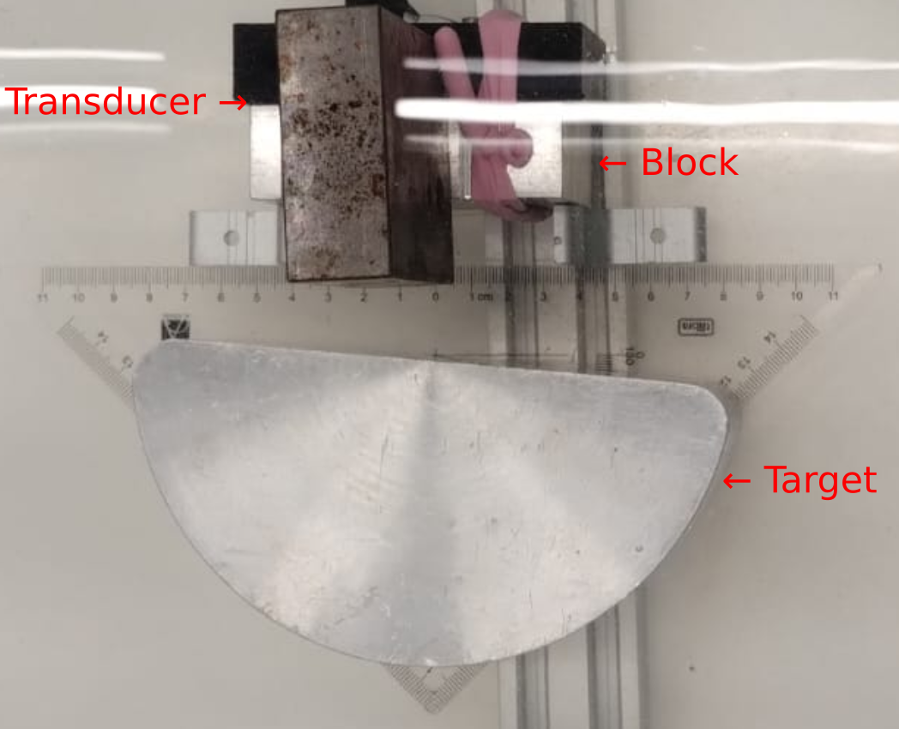
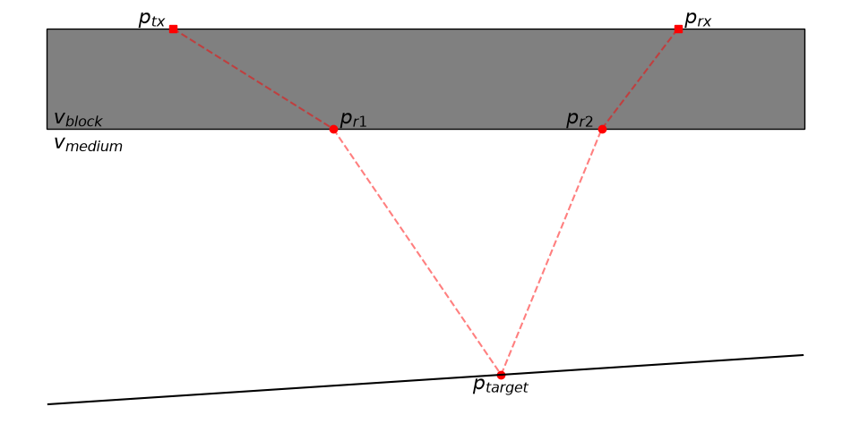
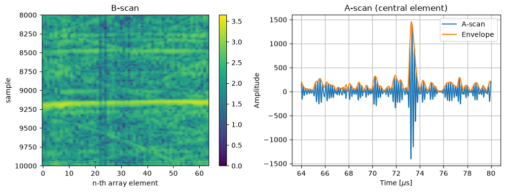
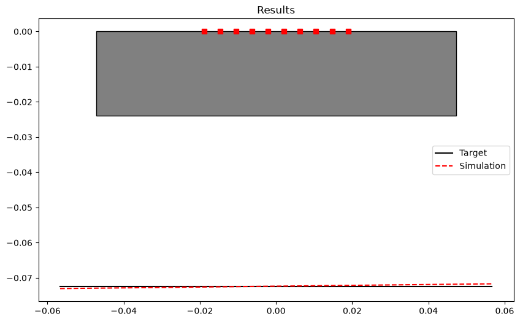

# Ultrasound Target Estimation via TOF Minimization

This project addresses the problem of estimating the position and angle of a reflecting target when ultrasonic waves propagate through an intermediate block before reaching the target and returning to the array.

The goal is to infer the target geometry from measured time-of-flight (TOF) data, without directly observing the target in the coupling medium. The method models the propagation path through the block and the surrounding medium, then adjusts the target parameters to minimize the mismatch between simulated and measured TOFs.

## Problem description

A linear ultrasonic array is placed on one side of a block of material with thickness $L_b$. The acoustic wave first travels through the block, then reaches a reflector located in the coupling medium on the other side, as shown in the figure:

Because the wave crosses two different media with different sound velocities, the physical path is refracted at the block surface and the reflector geometry must be estimated indirectly from the arrival times.

In this repository, the target is represented as a straight line:

$$
y = a x + b
$$

where:
- $a$ is the target inclination (angle),
- $b$ is the intercept (position relative to the array).

The unknowns are therefore the target line parameters, which define both the target location and its tilt.

This is a typical inverse problem: measured flight times are known, but the target geometry behind the block is not directly observable. The code solves this by using an optimization model that compares predicted and measured travel times.

## Physical model

For a transmitter-receiver pair, the propagation path is modeled as follows:

1. The wave travels from the transmitting element through the block to a refraction point.
2. It propagates through another coupling medium to a reflection point on the target line.
3. It returns through the coupling medium to a second refraction point on the block.
4. It travels through the block again to the receiving element.

As represented in the following figure.

The total time of flight is calculated as:

$$
T = \frac{\|p_{tx} - p_{r1}\|}{v_{block}} + \frac{\|p_{r1} - p_{target}\| + \|p_{target} - p_{r2}\|}{v_{medium}} + \frac{\|p_{r2} - p_{rx}\|}{v_{block}}
$$

where:
- $p_{tx}$ and $p_{rx}$ are the transmitter and receiver coordinates,
- $p_{r1}$ and $p_{r2}$ are the refraction points at the block boundary,
- $p_{target}$ is the reflection point on the target line,
- $v_{block}$ is the longitudinal wave velocity inside the block,
- $v_{medium}$ is the velocity in the coupling medium.

The implementation in [estimator/CostFunctions.py](estimator/CostFunctions.py) defines this path and evaluates it numerically for each element pair.

## Method used in the code

The code follows a TOF-minimization strategy. For the data acquisition, it was used the setup shown following figure.

### 1. Extract measured TOFs from the ultrasonic data

The script in [estimator/example.py](estimator/example.py) loads a .m2k dataset, isolates a region of interest, and computes the echo peak time for each element using the Hilbert transform envelope. The A and B scans of the data can be used to identify and isolate the Region Of Interest (ROI). In the following figure, the B-scan indicates that the ROI is between the 9000th and 9500th samples. The A-scan and its Hilbert transform are used to find the peak time.

This produces a matrix of arrival times that represents the measured propagation times for the array elements.

### 2. Define the transducer geometry

The transducer is modeled as a 1D array of elements spaced by a pitch, with coordinates:

- $x_i = -L/2 + i \cdot p$
- $y_i = 0$

where $p$ is the pitch and $L$ is the total aperture length.

### 3. Simulate the TOF for a candidate target line

The function `TOF(...)` computes the total travel time for a candidate target line defined by $a$ and $b$.

The function `GenerateTOFMatrix(...)` repeats this for every transmitter-receiver pair, yielding a simulated TOF matrix.

### 4. Define the cost function

The optimization objective compares the simulated TOF matrix with the measured matrix via an RMSE:

$$
J(a, b) = \sqrt{\sum_{i,j} \left(T_{sim}(i,j;a,b) - T_{meas}(i,j)\right)^2}
$$

This is implemented as `TOFCost(...)` in [estimator/CostFunctions.py](estimator/CostFunctions.py).

### 5. Estimate the target parameters by optimization

The target line parameters are found by minimizing the cost:

$$
(a^{\*}, b^{\*}) = \arg{\min_{a,b} J(a,b)}
$$

The code uses `scipy.optimize.minimize` with an initial guess, typically assuming a near-zero angle and an intercept close to the block boundary.

### 6. Visualize the result

After optimization, the fitted target line is overlaid on a plot with the block and transducer positions. This allows a direct comparison between the optimized simulated result and the true target geometry.

## Example workflow

The project example script does the following:

1. reads the M2K acquisition file,
2. reconstructs the B-scan from the ascan data,
3. extracts peak arrival times from the ROI,
4. solves the inverse problem for a line target,
5. plots the estimated target line against the real target geometry.

This is useful for understanding how the target direction and depth can be recovered from travel times even when the target is separated from the array by an acoustic block.

## Main files

- [estimator/CostFunctions.py](estimator/CostFunctions.py): TOF model, matrix generation, and optimization cost function.
- [estimator/example.py](estimator/example.py): full example showing data loading, peak extraction, optimization, and plotting.

## Summary

This repository solves an inverse ultrasonic imaging problem using TOF-based optimization. By modeling the wave path through an intermediate block and comparing simulated and measured arrival times, it estimates the target line parameters that best explain the observed data.

This is a compact and physically grounded way to recover target position and angle when direct line-of-sight observation is blocked by an intervening acoustic layer.
